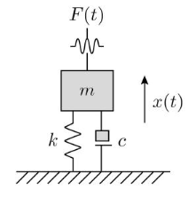
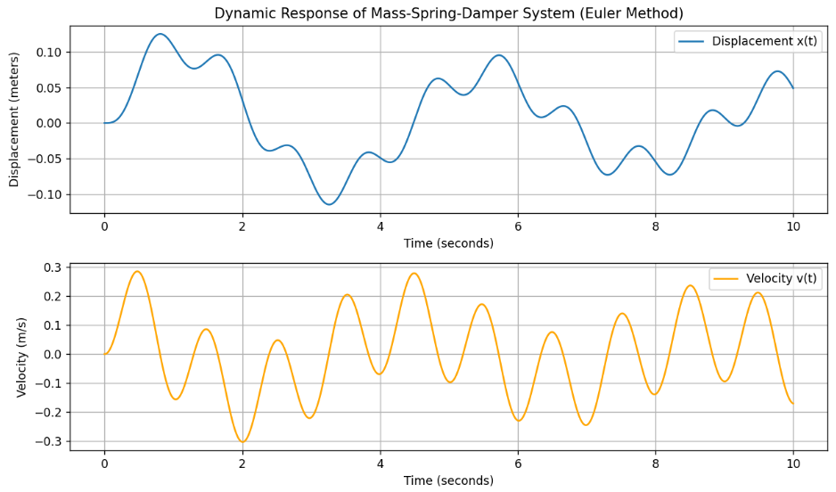
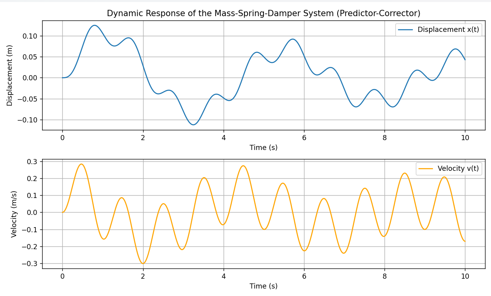
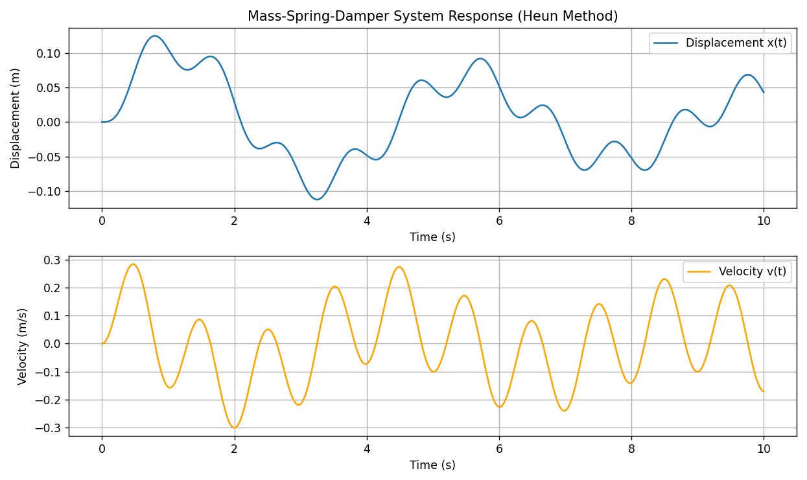
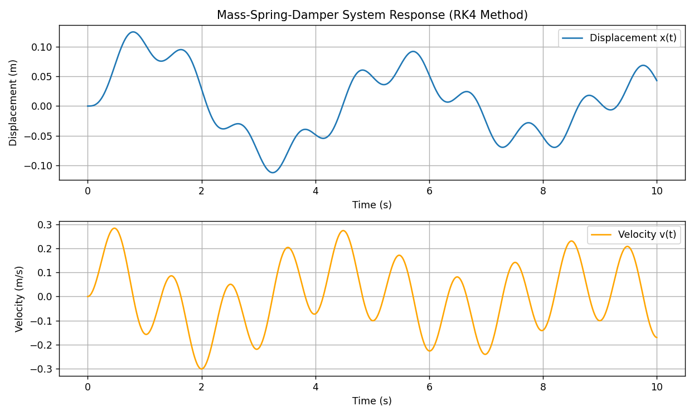
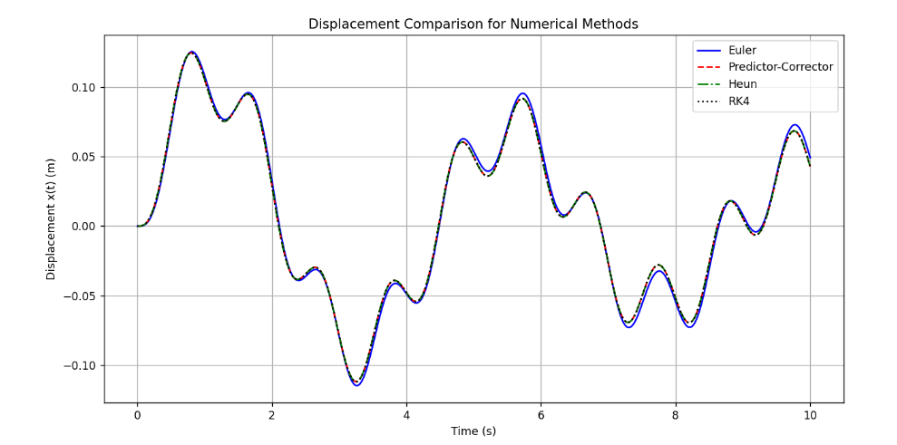
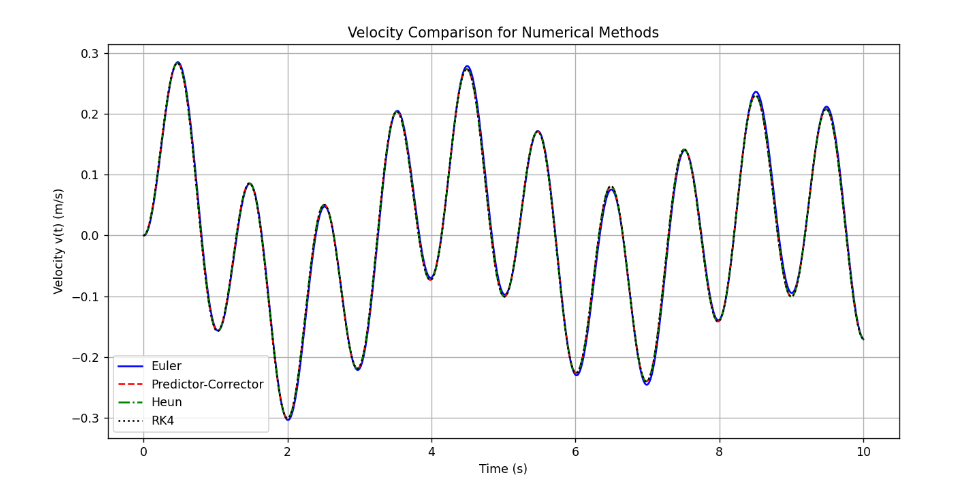

# Numerical Simulation and Comparative Analysis of a Mass-Spring-Damper System

## Overview
This project investigates the dynamic response of a single-degree-of-freedom mass-spring-damper system subjected to an external harmonic force. The physical system is modeled using a second-order ordinary differential equation (ODE), which is then converted into a system of first-order ODEs and solved using both analytical and numerical techniques in Python.

---

## Mathematical Modeling

The equation of motion for the system is given by:

$$m \frac{d^2x}{dt^2} + c \frac{dx}{dt} + k x(t) = F(t)$$

Where:
* $m = 1.0 \text{ kg}$ is the mass.
* $c = 0.2 \text{ Ns/m}$ is the damping coefficient.
* $k = 2.0 \text{ N/m}$ is the spring constant.
* $F(t) = \sin(2\pi t)$ is the external harmonic excitation force.
* $x(t)$ is the displacement of the mass relative to its equilibrium position.

To solve this numerically, the second-order equation is reduced to a system of two first-order differential equations by defining velocity $v(t) = \frac{dx}{dt}$:

$$\begin{cases}
\frac{dx}{dt} = v(t) \\
\frac{dv}{dt} = \frac{1}{m} \left[ F(t) - c v(t) - k x(t) \right] = \sin(2\pi t) - 0.2 v(t) - 2 x(t)
\end{cases}$$

Initial conditions are set to $x(0) = 0 \text{ m}$ and $v(0) = 0 \text{ m/s}$ over a time span of $T = 10 \text{ s}$ with a time step of $\Delta t = 0.01 \text{ s}$.

---

## Analytical Solution
The analytical solution combines the homogeneous solution $(x_h(t))$ of the damped oscillator and the particular solution $(x_p(t))$ driven by the harmonic forcing function using the method of undetermined coefficients:

$$x(t) = e^{-0.1t} \left[ 0.0008928 \cos(1.411t) + 0.11896 \sin(1.411t) \right] - 0.02664 \sin(2\pi t) - 0.0008928 \cos(2\pi t)$$

---

## Numerical Methods Implemented
Four distinct numerical integration schemes were implemented in Python using NumPy and Matplotlib:

1. Euler Method: A first-order explicit method that uses current slopes to advance the solution. Simple to implement but prone to cumulative error and instability in oscillatory systems.
2. Predictor-Corrector Method: Improves accuracy by predicting a tentative next state using the Euler step and then correcting it using averaged derivatives.
3. Heun's Method (Modified Euler): A second-order Runge-Kutta method that averages the initial and predicted slopes to achieve higher stability and accuracy.
4. 4th Order Runge-Kutta (RK4): Evaluates four increment stages per time step to provide high-order accuracy $\mathcal{O}(\Delta t^4)$, making it ideal for sensitive or highly oscillatory dynamical systems.

---

## Results and Visualizations

### 1. Euler Method Response

*Dynamic response of displacement $x(t)$ and velocity $v(t)$ using the Euler method.*

### 2. Predictor-Corrector Method Response

*Simulation results using the Predictor-Corrector algorithm.*

### 3. Heun's Method Response

*System response calculated via Heun's second-order method.*

### 4. 4th Order Runge-Kutta (RK4) Response

*High-precision dynamic response obtained using the RK4 method.*
### 5. Comparative Analysis of All Numerical Methods

*Overlay comparison of displacement and velocity trajectories across all four numerical solvers.*

---

## Conclusion & Key Takeaways
* Simplicity vs. Accuracy: While the Euler method is computationally straightforward, its first-order truncation error accumulates rapidly in oscillatory mechanical systems.
* Stability: Heun's and Predictor-Corrector methods offer second-order improvements by incorporating slope corrections, yielding stable trajectories.
* High-Precision Engineering: The RK4 method delivers superior accuracy and stability, making it the preferred standard for simulating complex physical dynamics despite its increased computational overhead per step.

---

## Requirements
* Python 3.x
* NumPy
* Matplotlib
